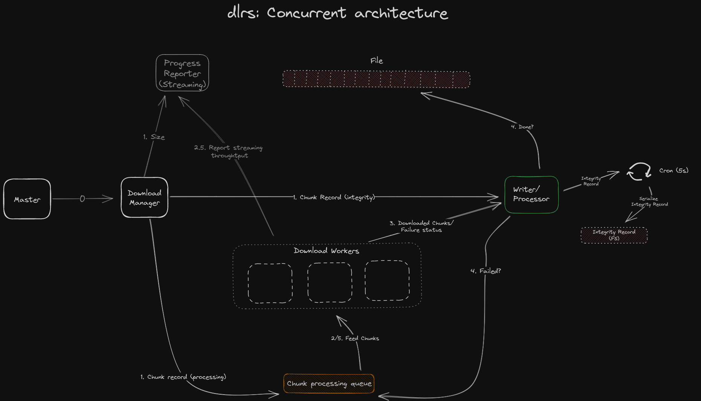

# `dlrs`

`dlrs` is a multi-protocol download tool for the command line. Written in Rust, dlrs
splits your downloads to speed them up where possible.


## Features

- [x] **Split downloads:** dlrs can split your download into multiple segments that are then pulled in parallel,
      dramatically speeding them up for hosts that limit download speeds per connection. This is the same technique
      used by tools such as IDM and XDM.
- [ ] **Use multiple hosts:** Downloading a file hosted by multiple speed-limiting hosts? dlrs can download the same file
      from multiple sources in parallel!
- [ ] **Multiple protocols:** dlrs supports HTTP/HTTPS and FTP/SFTP.
- [x] **Lightweight:** Written in Rust, dlrs comes packaged in a single binary at \_\_ MB.
- [ ] **Remote Control (_planned_ )** RPC interface to control a dlrs daemon. Can be used for remote automation and building
      graphical interfaces on top of dlrs.

## Installation

While automated builds are planned, `dlrs` can be installed with [cargo][cargo] on any machine:

```shell
cargo install dlrs
```

## Usage Examples

- `dlrs -s 2 https://example.org/some-linux.iso` Download file with 2 splits.
  <!-- - `dlrs https://example.org/some-linux.iso https://example.com/some-linux.iso`. Download from 2 sources. -->

[cargo]: https://doc.rust-lang.org/cargo/

## How it works

The diagram describes most working parts of `dlrs`. It's close to what you'll find on reading the code.



## License

The project is [licensed](./LICENSE) under the MIT license.

## Contributing

Both issues and pull requests are accepted. I welcome contributors to take a dig at making my terrible code less
terrible. 🐙
